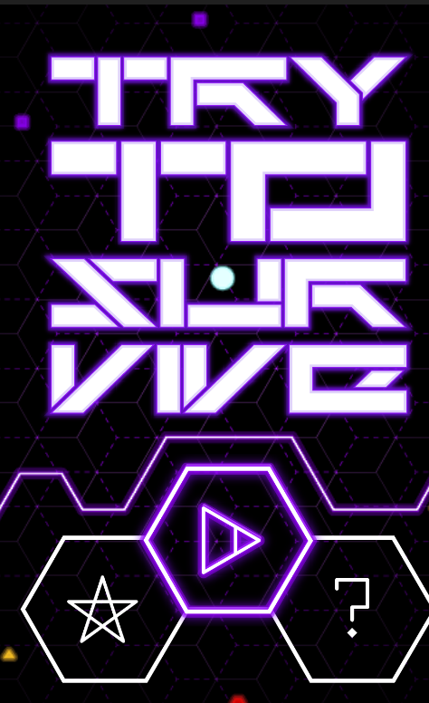

LastManStanding
===============

Desenvolvimento:
----------------
Unity 4.3+:

Unity 2D Tutorial:      (Funções do Unity introduzidas na versão 4.3)
http://pixelnest.io/tutorials/2d-game-unity/

Animacao:
http://michaelcummings.net/mathoms/creating-2d-animated-sprites-using-unity-4.3#.U1bZufldUhQ

SVN:
----------------
GitHub para Mac:
https://mac.github.com/

GitHub para Windows:
https://windows.github.com/

Unity SVN Info:
http://docs.unity3d.com/Documentation/Manual/ExternalVersionControlSystemSupport.html

